<!-- --------------------------------- header ---------------------------------- -->

  

  

  

  
  

  
  

---

<!-- --------------------------------- Languages and Tools ---------------------------------- -->

  <h1>🛠 Languages and Tools</h1>
  

    
  

  

    
    
  

---

<!-- --------------------------------- Latest Blog Post ---------------------------------- -->

  <h1>✍ Latest Blog Posts</h1>
  <ul align="left">
<!-- BLOG-POST-LIST:START --><li><a href="https://qiita.com/tyskJ/items/243627ebf54fe79ae4c4">【初心者向け】AWS Code シリーズ徹底入門 - ③ AWS CodeBuild 編</a></li>
<li><a href="https://qiita.com/tyskJ/items/d532134ad04380307b0c">【初心者向け】AWS Code シリーズ徹底入門 - ② AWS CodeCommit 編</a></li>
<li><a href="https://qiita.com/tyskJ/items/68e53ef565cc04210d2e">【初心者向け】AWS Code シリーズ徹底入門 - ① 概要編</a></li>
<li><a href="https://qiita.com/tyskJ/items/e44e02a4a1fb6becddde">OCI の有料アカウント &lpar;Pay as You Go&rpar; で テクニカル・サポート・リクエスト を利用するまでの手順</a></li>
<!-- BLOG-POST-LIST:END -->
  </ul>

---
<!-- --------------------------------- Certifications ---------------------------------- -->

  <h1>🏆 Certifications</h1>
   
  
  
  
  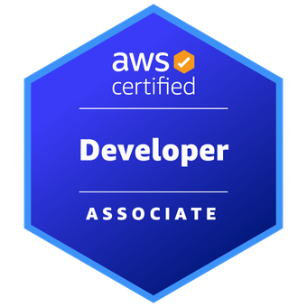
  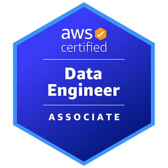
  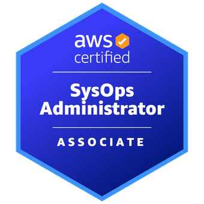
  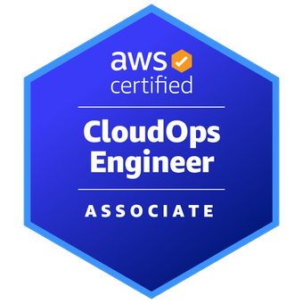
  
  
  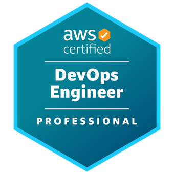
  
   
   
  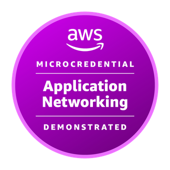
  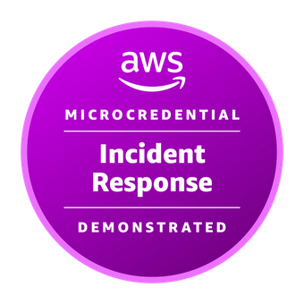
  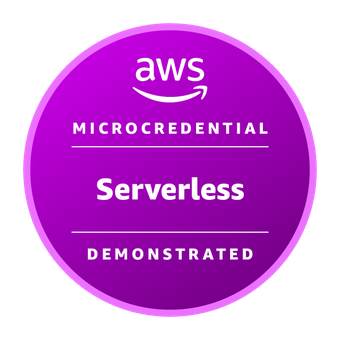
   
   
  
   
   
  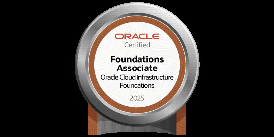
  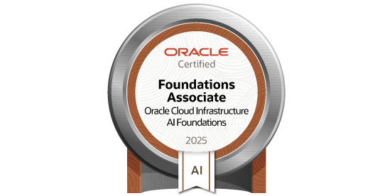
  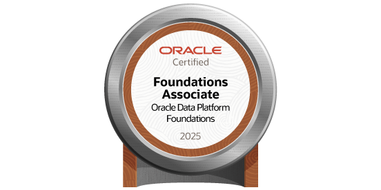
  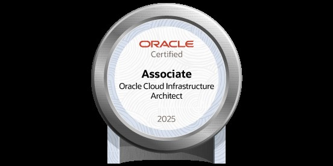
   
   
  
  
   
   
  <h2>📜🚫 Retirements</h2>
  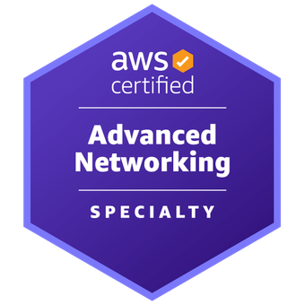
  
  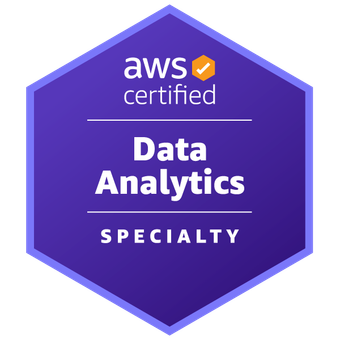
  
  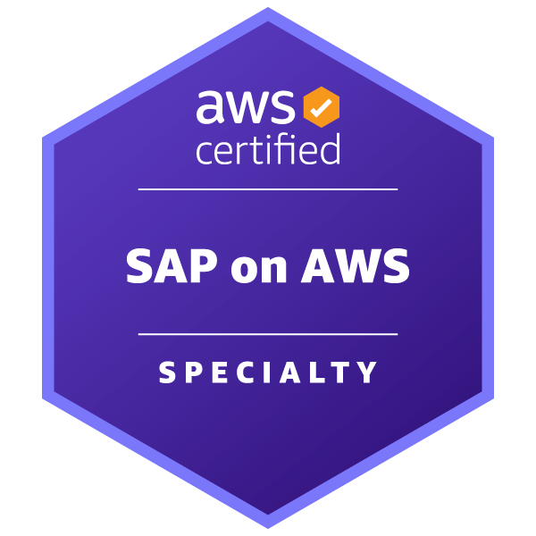

<!-- --------------------------------- Footer ---------------------------------- -->

  

  

